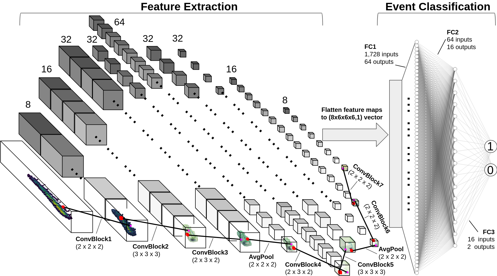

# BEAST_TPC_3D_ConvNet
Example repository containing data processing and analysis tools for event classification and directional assignment of TPC recoil events using 3D convolutional neural networks. We include sample data, a sample trained model, files for the network architecture, custom PyTorch DataLoader classes, and a training/evaluation script.

Not enough data is provided to train the 3DCNN, however calling models/trained.pth in evaluate.py will evaluate head-tail on the generated tensors.

### Recommended usage order after cloning:
1. Extract tensors from tarball using tar -xvf tensors.tar.gz tensors
2. Run evaluate.py
3. Analyze the results of the output file. An example analysis is shown in analyze_output.ipynb

### Alternatively you can generate tensors yourself
1. Create an empty folder in the parent directory called 'tensors'
2. Open up a jupyter notebook session and run through each cell of Labeling_and_tensors.ipynb
3. After step (2) you will have generated tensors for all 1,000 events
4. Run evaluate.py
5. Analyze the results of the output file. An example analysis is shown in analyze_output.ipynb

