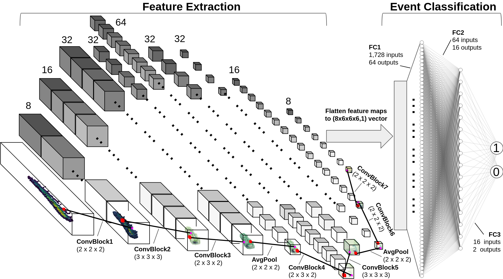

# BEAST_TPC_3D_ConvNet
Example repository containing data processing and analysis tools for vector directional assignment of TPC recoil events using 3D convolutional neural networks. We include sample data, a sample trained model, a file for the network architecture, a custom PyTorch DataLoader class, and a training/evaluation script.

Not enough data is provided to train the 3DCNN, however calling `models/trained.pth` in **`evaluate.py`** will evaluate head-tail using a trained 3DCNN on the generated tensors. `models/trained.pth` was trained using hundreds of thousands of simulated recoil events.

### Recommended usage order after cloning:
1. Extract tensors from tarball using `tar -xvf tensors.tar.gz` tensors
2. Run **`evaluate.py`** **(Note: pyarrow is required to read and write feather files through pandas and can be installed using either pip or anaconda)**
3. Analyze the results of the output file. An example analysis is shown in **`analyze_output.ipynb`**

### Alternatively you can generate tensors yourself
1. Create an empty folder in the parent directory called `tensors`
2. Open up a jupyter notebook session and run through each cell of **`Labeling_and_tensors.ipynb`**
3. After step (2) you will have generated tensors for all 1,000 events
4. Run **`evaluate.py`**
5. Analyze the results of the output file. An example analysis is shown in **`analyze_output.ipynb`**

